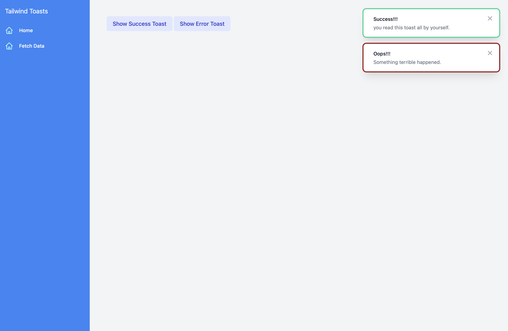

# TailBlazor.Toast

Blazor toast notifications shell using TailBlazorcss v2.0+

Thank you to Chris Sanity for the base functionality through Blazored.Toasts.

This version uses TailBlazorcss instead of bootstrap. There is also no core notifications in this package. With TailBlazor being so incredibly low level it didn't make sense to premake notifications.

Instead you pass it a component through a renderfragment giving you unlimited customization and the ability to have highly interactive notifications.




## Getting Setup

You can install the package via the NuGet package manager just search for Blazored.Toast. You can also install via powershell using the following command.

`Install-Package TailBlazor.Toast`

Or via the dotnet CLI.

`dotnet add package TailBlazor.Toast`

### 1. Register Services

register toast service

Blazor Server

Add to Startup.ConfigureServices method in Startup.cs

`services.AddTailBlazorToast();`

### 2. Add Imports

Add lines to your \_Imports.razor

`@using TailBlazor.Toast.Services @using TailBlazor.Toast`

### 3. Register and Configure Toasts Component

Add this to the top of your MainLayout.razor component.

`<TailBlazorToasts />`

#### 4. Create your toast component

Because there are no default styles, you'll need to create the template that you'll use for some or all of your toasts using TailBlazor.

Here is a basic example. Create a folder named `Toasts` and create a component called `SimpleToast.razor` and add the following code.

```
<div class="pointer-events-auto p-4 mb-5 bg-white shadow-xl ring ring-blue-500 rounded-lg">
    <div class="flex items-start">
        <div class="flex-shrink-0">
            <svg xmlns="http://www.w3.org/2000/svg" fill="none" viewBox="0 0 24 24" stroke="currentColor">
                <path stroke-linecap="round" aria-hidden="true" stroke-linejoin="round" stroke-width="2"
                    d="M9 12l2 2 4-4M7.835 4.697a3.42 3.42 0 001.946-.806 3.42 3.42 0 014.438 0 3.42 3.42 0 001.946.806 3.42 3.42 0 013.138 3.138 3.42 3.42 0 00.806 1.946 3.42 3.42 0 010 4.438 3.42 3.42 0 00-.806 1.946 3.42 3.42 0 01-3.138 3.138 3.42 3.42 0 00-1.946.806 3.42 3.42 0 01-4.438 0 3.42 3.42 0 00-1.946-.806 3.42 3.42 0 01-3.138-3.138 3.42 3.42 0 00-.806-1.946 3.42 3.42 0 010-4.438 3.42 3.42 0 00.806-1.946 3.42 3.42 0 013.138-3.138z" />
            </svg>
        </div>
        <div class="ml-3 w-0 flex-1 pt-0.5">
            <p class="text-sm font-medium text-gray-900">Info!</p>
            <p class="mt-1 text-sm text-gray-500">Nothing to worry about, everything is working great</p>
        </div>
        <div class="flex flex-shrink-0 ml-4">
            <button
                class="inline-flex text-gray-400 bg-white rounded-md hover:text-gray-500">
                <span class="sr-only">Close</span>
                <svg class="w-5 h-5" xmlns="http://www.w3.org/2000/svg" viewBox="0 0 20 20" fill="currentColor"
                    aria-hidden="true">
                    <path fill-rule="evenodd"
                        d="M4.293 4.293a1 1 0 011.414 0L10 8.586l4.293-4.293a1 1 0 111.414 1.414L11.414 10l4.293 4.293a1 1 0 01-1.414 1.414L10 11.414l-4.293 4.293a1 1 0 01-1.414-1.414L8.586 10 4.293 5.707a1 1 0 010-1.414z"
                        clip-rule="evenodd" />
                </svg>
            </button>
        </div>
    </div>
</div>
```

#### 5. Use your toast component

Go to Index and inject your toast service

`@inject IToastService toastService`

then add a button to trigger your toast

```
<button type="button" @onclick="@ShowToast" class=" px-6 py-2 text-base font-bold text-indigo-700 bg-indigo-100 rounded-lg hover:bg-indigo-200 ">Show Toast</button>
```

finally create the ShowToast method to activate your toast.

```
private void ShowSuccess()
{
    RenderFragment toast = @<SimpleToast />;
    toastService.ShowToast(toast);
}
```
